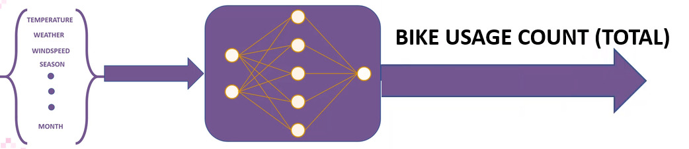

## Introduction

This is a Machine Learning project developed as part of my Predictive Analytics studies with Code Institute. This is my 5th Portfolio Project. It is based on a dataset of bike rental in Washington D.C. Dataset.

The Project is both a data analysis and a machine learning application. The data analysis helps users understand what factors affect the use of bike insted of other transport services such as bus or subway, the duration of travel, departure and arrival position. The machine learning application allows users to input temperature, humidity, wind speed,...etc information and get predictions of bike rental usage.

The project is deployed here:

## Business Requirements

Bike sharing systems are a new generation of traditional bike rentals where the whole process from membership, rental and return back has become automatic. Through these systems, user is able to easily rent a bike from a particular position and return back to another position. Currently, there are about over 500 bike-sharing programs around the world which are composed of over 500 thousands bicycles. Today, there exists great interest in these systems due to their important role in traffic, environmental and health issues.

Apart from interesting real-world applications of bike sharing systems, the characteristics of data being generated by these systems make them attractive for the research. Opposed to other transport services such as bus or subway, the duration of travel, departure and arrival position is explicitly recorded in these systems. This feature turns bike sharing system into a virtual sensor network that can be used for sensing mobility in the city. Hence, it is expected that most of important events in the city could be detected via monitoring these data.

The local bike business wants to perform customer segmentation, perform target marketing campaigns,so they can predict what is the daily revenue or expected seasonal revenue, based on the outside air temperature, humidity etc.
 They want me to undertake 3 tasks:

- Firstly, they want me to study the usage of bike data to find patterns and relationships, with the goal of identifying what variables correlate to count of total rental bikes including both casual and registered. These correlations will then be used to formulate sharing/rental policy with the aim of improving rental usage generally

- Secondly, they want me to produce a Machine Learning tool that their employers can use to input data about a particular season and get a predictions of that season. 

- Thirdly, the Bike Business has indicated that the Machine Learning tool to be held within a dashboard for ease of use

## Dataset

The Bike business uploaded the dataset to Kaggle. It is located [here](https://www.kaggle.com/datasets/xheni2810/predict-bike-rental-usage-using-an).

This dataset contains the hourly and daily count of rental bikes between years 2011 and 2012 in Capital [bikeshare system](https://capitalbikeshare.com/system-data) in Washington, DC with the corresponding weather and seasonal information.

## Business Requirements
Based on the input provided, the business requirements for a bike rental business are:

* 1 - Rental Rates: The rental rates should be competitive and adjusted based on the season, month, hour, and weather condition.
* 2 - Rental Duration: The rental duration should be flexible and aligned with the workingday and holiday schedule.
* 3 -  Rental History and Analytics
    *  Keep track of user rental history and generate usage reports for analytical purposes
    *  Use collected data (e.g., weather, time, location) to optimize bike availability, pricing, and promotions
* 4 - Weather and Environmental Considerations
    * Adjust bike availability and rental recommendations based on current and forecasted weather conditions
    * Encourage environmentally friendly practices by promoting bike usage during low-emission periods

## Hypotheses

After discussions with the business owner, I have formulated several hypotheses. These hypotheses will guide the data analysis.

## Hypothesis and how to validate?
1. Bike rentals will be higher during the summer season compared to other seasons.
    * Reasoning: Summer is typically associated with warmer weather and longer days, which may encourage more people to rent bikes for recreational purposes.

2. Bike rentals will be higher on weekends compared to weekdays.
    * Reasoning: People may have more free time on weekends and may be more likely to rent bikes for leisure activities.

3. Bike rentals will be higher on workingdays compared to holidays.
    * Reasoning: People may use bikes as a mode of transportation to work on workingdays, resulting in an increase in bike rentals.

4. Bike rentals will be lower on days with heavy rain or snowfall.
    * Reasoning: Inclement weather may discourage people from renting bikes for leisure or transportation purposes.

5. Bike rentals will be higher during daytime hours compared to nighttime hours.
    * Reasoning: Daytime hours are typically associated with more leisure activities and transportation needs, which may result in higher bike rentals.

6. Bike rentals will be higher when the temperature is mild (around 20-25 degrees Celsius) compared to extremely hot or cold temperatures.
    * Reasoning: Mild temperatures may be more comfortable for outdoor activities like bike riding, while extremely hot or cold temperatures may be less appealing.

7. Bike rentals will be higher on days with clear weather conditions compared to days with mist or rain.
    * Reasoning: Clear weather conditions may make bike riding more enjoyable and safer compared to mist or rain.

## The rationale to map the business requirements to the Data Visualisations and ML tasks
* Now that the business requirements and data hypotheses have been laid down, it is now necessary to determine how the business requirements will be achieved and how the hypotheses will be validated

## ML Business Case
* Problem Statement:
The bike rental business wants to optimize rental history and analytics, and weather and environmental considerations to increase profitability and customer satisfaction.

* Data Collection:
We will collect data on temperature, weather conditions, bike availability, and user rental history.

* Data Preprocessing:
We will preprocess the data by cleaning and transforming it into a format that can be used for modeling.

* Feature Engineering:
We will engineer features from the data, such as weather conditions, time of day, location, and day type (holiday, working day, weekend), to optimize bike availability, pricing, and promotions.

* Model Development:
We will develop ML models that can predict rental usage based on the input features. We will use regression and classification models for this purpose.

* Model Evaluation:
We will evaluate the ML models using metrics such as mean squared error, accuracy, and precision/recall to ensure they are accurate and effective.

* Deployment:
Once the ML models are trained and evaluated, we will deploy them into the bike rental system to optimize rental usage based on the input features.

* Maintenance and Monitoring:
We will continuously monitor the ML models' performance and update them as needed to ensure they are effective and accurate over time.

* Business Outcomes:
By utilizing ML to optimize rental usage, rental history and analytics, and weather and environmental considerations, our bike rental business can increase profitability, improve customer satisfaction, and promote environmentally friendly practices. Additionally, the business can gain a competitive advantage by offering optimized rental usage based on the input features. The ML models can also provide insights into user rental behavior and preferences that can inform future business decisions.

## Dashboard Design (Streamlit App User Interface)
### Page 1: Quick project summary
* Quick project summary
	* Quick Project Summary
	* Describe Project Dataset
	* State Business Requirements

### Page 2: Customer Base Bike Rental Study
* Before the analysis, we knew we wanted this page to answer business requirement 1, but we couldn't know in advance which plots would need to be displayed.
* After data analysis, we agreed with stakeholders that the page will: 
	* State business requirement 1
	* Checkbox: data inspection on customer base (display the number of rows and columns in the data, and display the first ten rows of the data)
	* Checkbox: Display Weekly Usage
	* Checkbox: Display Monthly Usage
    * Checkbox: Correlation of the distribution

### Page 3: Bike Rental Correlation
* State business requirement 2
* Set of widgets inputs, which relates to the prospect profile. Each set of inputs is related to a given ML task to predict usage

### Page 4: Predict Bike Rental
* Considerations and conclusions after the pipeline is trained
* Present ML pipeline steps
* Feature importance
* Pipeline performance

## Unfixed Bugs
* At the second page Bike Rental Study, if the checkbox Monthly Usage is checked but not the Rental Weekly, then there will be display the usage for Month in blue and the usage for week in orange.

## Deployment
### Heroku

The App does not deploy on Heroku because of an Error library version of scipy

* The App live link is: https://bikerental.herokuapp.com/ 
* Set the runtime.txt Python version to a [Heroku-20](https://devcenter.heroku.com/articles/python-support#supported-runtimes) stack currently supported version.
* The project was deployed to Heroku using the following steps.

1. Log in to Heroku and create an App
2. At the Deploy tab, select GitHub as the deployment method.
3. Select your repository name and click Search. Once it is found, click Connect.
4. Select the branch you want to deploy, then click Deploy Branch.
5. The deployment process should happen smoothly if all deployment files are fully functional. Click the button Open App on the top of the page to access your App.
6. If the slug size is too large then add large files not required for the app to the .slugignore file.

## Main Data Analysis and Machine Learning Libraries
* Here you should list the libraries you used in the project and provide example(s) of how you used these libraries.

### Technologies

- Github was used to create the project's repository and store the project's files

- Gitpod was used to create and edit the project's files

- Heroku was used to deploy the project

- Slack was used to communicate with other students

- Kaggle was used to source the dataset for this project, and provide an API token allowing it to be downloaded

### Libraries and Packages

- [NumPy](https://numpy.org/) was used for basic mathematical operations such as standard deviations and mean values

- [Pandas](https://pandas.pydata.org/) was used for many operations:
    - Loading CSV files into Series and Dataframes
    - Saving Series and Dataframes as CSV files
    - Creating and modifying Series and Dataframes
    - Creating a Pandas Profile Report to initially explore the data
    - The correlation method for conduction the correlation study

- [MatPlotLib](https://matplotlib.org/) and [Seaborn](https://seaborn.pydata.org/) were used for constructing plots to visualise my data analyses, in particular countplots and barplots

- [Plotly](https://plotly.com/python/) was used for constructing interactive plots to visualise my data analyses, in particular several parallel plots

- [Feature Engine](https://feature-engine.readthedocs.io/en/1.1.x/) was used for machine learning tasks:
    - The OrdinalEncoder allowed me to encode categorical variables within the various pipelines used in this project
    - The EqualFrequencyDiscretiser and ArbitraryDiscretiser modules enabled me to discretise the datasets for the classification tasks
    - The OneHotEncoder enabled me to encode the dataset for the correlation study

- [SciKit Learn](https://scikit-learn.org/stable/) was used for many machine learning tasks:
    - Provided the various algorithms used to train the regression and classification model
    - Pipeline for building machine learning pipelines
    - SelectFromModel for feature selection steps in the pipelines
    - Train-Test Split for creating train and test sets
    - Make Scorer and Recall Score for assessing algorithm and hyperparameter performance
    - Classification Report and Confusion Matrix for constructing classification reports and confusion matrices for assessing model performance

### Resources

The following resources were used to assist in the construction of this project:

- The Bike business uploaded the dataset to Kaggle. It is located [here](https://www.kaggle.com/datasets/xheni2810/predict-bike-rental-usage-using-an).

- The Bike business dataset is reference by [Predict Bike Rental Usage Using ANNs (Regression Task)](https://colab.research.google.com/drive/1xwNiawxGiag04F5rDy_CZZZjbnnm63WX)

- [My Fork of the Churnometer Walkthrough Project](https://github.com/AdamBoley/churnometer) proved to be of immense assistance. Firstly, I took several code blocks from it, which were used in the regression and classification model training. These are:
    - The HyperparameterOptimizationSearch class, used for testing several algorithms and their hyperparameters
    - The functions for generating a classification report and a confusion matrix
    - The code for assessing feature importance

- Secondly, the Churnometer project provided a general structure for me to follow in planning and executing this project. The idea of conducting a machine learning project was daunting early on, and following the workflow of the Churnometer project was useful in getting this project off the ground so that I could settle into it and make it my own

## Acknowledgements
* My husband Bernardo for his support and advice.
* Students of Code Institute on slack.

